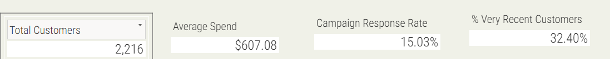
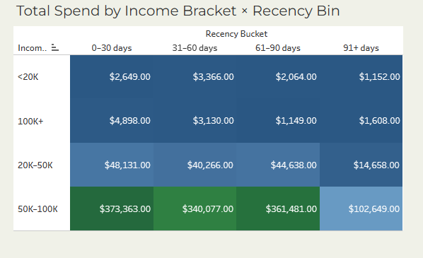

# -Customer-Response-Analysis-for-Marketing-Optimization

## Project Overview  
This project analyzes the effectiveness of a marketing campaign by exploring customer demographics, recency, income brackets, and campaign responses.  
The objective was to identify **key customer segments**, **campaign performance drivers**, and **opportunities for optimization**.  

The analysis was performed using **Excel (data cleaning, feature engineering, exploratory analysis)** and **Tableau (dashboard development)**.  

---

## Dataset  
The dataset contained customer-level marketing data with the following fields:  
- Age  
- Income  
- Campaign Response (Yes/No)  
- Recency (days since last engagement)  
- Total Spend  

## Additional engineered fields:  
- **Income Bracket** (Low, Mid, High, Very High)  
- **Age Group** (Young Adult, Adult, Senior)  
- **Recency Bin** (0–30, 31–60, 61–90, 91+ days)  
- **Campaign Response Type**  

---

## Process  
### 1. **Data Cleaning & Preparation (Excel)**  
- Handled missing values in `Income`.  
- Created new features (`Income Bracket`, `Age Group`, `Recency Bin`).  
- Standardized campaign response values.  

### 2. **Exploratory Data Analysis (Excel)**  
- Used pivot tables & charts to explore patterns.  
- Checked distributions across age, income, and recency bins.  

### 3. **Dashboard Development (Tableau)**  
-  KPI Cards: Total Customers, Total Spend, Response Rate, Avg Recency 

-  Heatmap: Spend by Income Bracket × Recency Bin  

- 🎯 Scatter Plot: Spend vs Recency (colored by Campaign Response)  
- 🎛️ Interactivity: Heatmap-as-filter + dropdown filters  

---

<!-- ## 📈 Key Insights  
1. **High-income & recent customers contribute the most spend** → campaigns targeting this group are most profitable.  
2. **Response rates decline sharply with higher recency** → engagement drops the longer customers stay inactive.  
3. **Middle-income segments show moderate spend but weaker response rates** → require tailored retention efforts.  
4. **Responders cluster at lower recency & higher spend** → outreach timing is critical for campaign success.  
5. **Non-responders dominate long-recency bins** → these customers represent churn risk.  

---

## 🛠️ Tools Used  
- **Excel** → Data cleaning, transformation, feature engineering, initial EDA  
- **Tableau** → Dashboard design and visualization  

---

## 📊 Dashboard  
🔗 [View the Interactive Tableau Dashboard](#) *(Insert your Tableau Public link here)*  

---

## 🚀 Recommendations  
- Prioritize **recent, high-income customers** in campaign targeting.  
- Use **recency-based segmentation** to optimize outreach timing.  
- Develop **reactivation campaigns** for medium-income, long-recency customers.  
- Implement **loyalty rewards & automated reminders** to reduce inactivity.  

---

✍️ *Author: Peris Ndanu*  
📅 *Completed: August 2025*   -->
