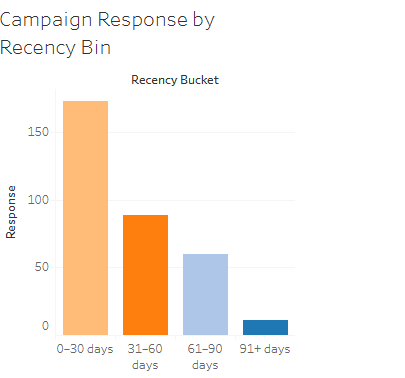

# -Customer-Response-Analysis-for-Marketing-Optimization

## Project Overview  
This project analyzes the effectiveness of a marketing campaign by exploring customer demographics, recency, income brackets, and campaign responses.  
The objective was to identify **key customer segments**, **campaign performance drivers**, and **opportunities for optimization**.  

The analysis was performed using **Excel (data cleaning, feature engineering, exploratory analysis)** and **Tableau (dashboard development)**.  

---

## Dataset  
The dataset contained customer-level marketing data with the following fields:  
- Age  
- Income  
- Campaign Response (Yes/No)  
- Recency (days since last engagement)  
- Total Spend  

## Additional engineered fields:  
- **Income Bracket** (Low, Mid, High, Very High)  
- **Age Group** (Young Adult, Adult, Senior)  
- **Recency Bin** (0–30, 31–60, 61–90, 91+ days)  
- **Campaign Response Type**  

---

## Process  
### 1. **Data Cleaning & Preparation (Excel)**  
- Handled missing values in `Income`.  
- Created new features (`Income Bracket`, `Age Group`, `Recency Bin`).  
- Standardized campaign response values.  

### 2. **Exploratory Data Analysis (Excel)**  
- Used pivot tables & charts to explore patterns.  
- Checked distributions across age, income, and recency bins.  

### 3. **Dashboard Development (Tableau)**  
- 📌 KPI Cards: Total Customers, Total Spend, Response Rate, Avg Recency  
- 🔥 Heatmap: Spend by Income Bracket × Recency Bin  
- 🎯 Scatter Plot: Spend vs Recency (colored by Campaign Response)  
- 📊 Bar/Line Charts: Campaign Response by Age, Income, Recency  
- 🎛️ Interactivity: Heatmap-as-filter + dropdown filters 

## Key Insights  
- **High-income + recent customers = top spenders**  
  These customers generate the highest revenue and respond well to campaigns.  

- **Recency drives response rates**  
  The longer customers stay inactive, the less likely they are to engage again.  

- **Middle-income customers = retention opportunity**  
  They spend moderately but show weaker response rates → need targeted reactivation strategies.  

- **Responders = high spend + low recency**  
  Active customers are most responsive when campaigns are timed correctly.  

- **Non-responders = long recency risk**  
  Customers inactive for long periods show low engagement and higher churn risk.  

## Chart Insights  
-  **Heatmap**: Spend by Income Bracket × Recency Bin  

   Insights => **High-income customers with recent activity are the biggest spenders.Across all income brackets, spend declines as recency increases.Income and recency together strongly predict spending.**

-  Scatter Plot: Spend vs Recency (colored by Campaign Response) 

   Insights=> **Responders cluster around high spend and low recency, showing that active, high-spend customers are most engaged.Non-responders dominate long-recency, low-spend regions, highlighting disengagement.**
- Bar Chart: Response Rate by Income bracket
    
    Insights=>**Higher income brackets show stronger response rates, particularly when paired with recent activity.Low-income groups are less responsive overall, even when recently active.**

- Bar Chart: Response Rate by Recency Bin
    
    
    Insights => **Response rates are highest among customers with recent activity (0–30 days).Engagement drops steadily as recency increases, with the lowest response in the 91+ days group**

## 🛠️ Tools Used  
- **Excel** → Data cleaning, transformation, feature engineering, initial EDA  
- **Tableau Public** → Dashboard design and visualization  

## 📊 Dashboard  
🔗 [View the Interactive Tableau Dashboard](https://public.tableau.com/views/MarketingCampaignDashboard_17549912420490/Dashboard2_1?:language=en-US&:sid=&:redirect=auth&:display_count=n&:origin=viz_share_link) 

---

## 🚀 Recommendations  
- Prioritize **recent, high-income customers** in campaign targeting.  
- Use **recency-based segmentation** to optimize outreach timing.  
- Develop **reactivation campaigns** for medium-income, long-recency customers.  
- Implement **loyalty rewards & automated reminders** to reduce inactivity.  

---

✍️ *Author: Peris Ndanu*  
📅 *Completed: August 2025*  
